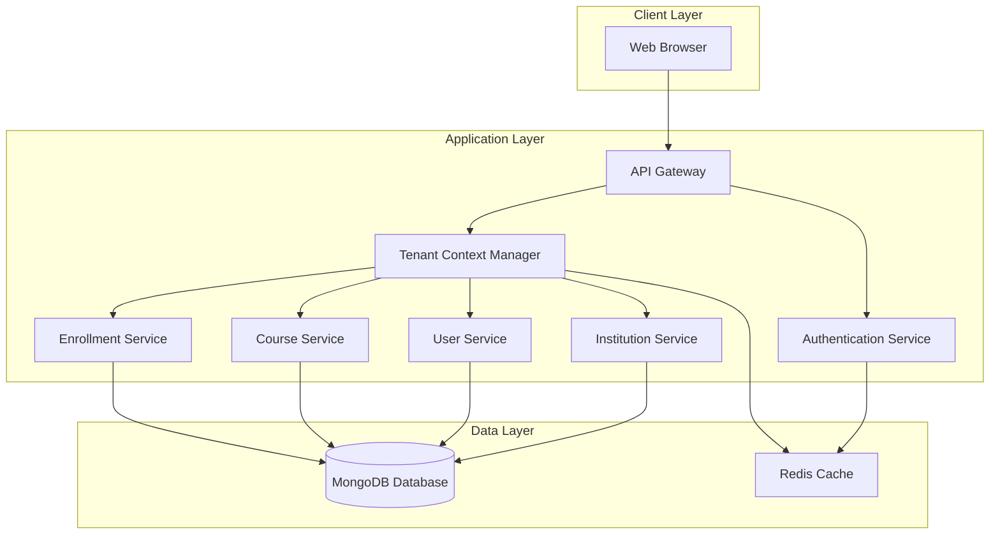
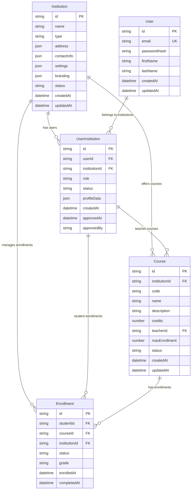

# Design Document: Multi-Institution Support

## Overview

The Multi-Institution Support system transforms the existing single-tenant student portal into a comprehensive multi-tenant platform. The system enables multiple educational institutions to operate independently on a shared infrastructure while maintaining complete data isolation and institutional autonomy.

The design follows a single-domain architecture where all institutions are accessed through the main platform URL, with institutional context managed through application logic rather than subdomain routing. This approach simplifies infrastructure management while providing robust multi-tenancy capabilities.

## Architecture

### High-Level Architecture



### Multi-Tenancy Strategy

The system implements a **shared database, shared collection** multi-tenancy pattern with the following characteristics:

- **Single MongoDB Database**: All institutions share the same database instance
- **Tenant Isolation**: Every document includes an `institutionId` field for data isolation
- **Application-Level Filtering**: All queries include institutional context filtering
- **Shared Infrastructure**: Common services and resources are shared across institutions
- **Isolated Data**: Complete logical separation of institutional data through consistent filtering

**Data Isolation Enforcement**:
```javascript
// Example middleware for automatic institutional filtering
const ensureInstitutionalContext = (req, res, next) => {
  if (!req.user.currentInstitutionId) {
    return res.status(400).json({ error: 'Institution context required' });
  }
  req.dbFilter = { institutionId: req.user.currentInstitutionId };
  next();
};

// Example service method with institutional filtering
async getCourses(filter = {}) {
  return await Course.find({ 
    ...filter, 
    institutionId: this.currentInstitutionId 
  });
}
```

## Components and Interfaces

### Service Architecture Pattern

**Services** in this design represent the business logic layer that encapsulates domain-specific operations and enforces business rules. Each service:

- **Encapsulates Business Logic**: Contains the core logic for a specific domain (users, courses, enrollments, institutions)
- **Enforces Data Isolation**: Automatically applies institutional context filtering to all operations
- **Provides Clean Interfaces**: Exposes well-defined methods that abstract away implementation details
- **Handles Cross-Cutting Concerns**: Manages validation, authorization, logging, and error handling
- **Coordinates with Data Layer**: Interacts with repositories and database access objects
- **Maintains Consistency**: Ensures data integrity and business rule compliance across operations

Services are implemented as TypeScript classes that can be dependency-injected into controllers, making the system modular and testable.

### 1. Tenant Context Manager

**Purpose**: Manages institutional context throughout the application lifecycle.

**Key Responsibilities**:
- Establish and maintain institutional context for each request
- Validate user access to institutional resources
- Provide tenant-aware database query filtering

**Interface**:
```typescript
interface TenantContextManager {
  setInstitutionContext(institutionId: string, userId: string): Promise<void>
  getCurrentInstitution(): Institution | null
  validateAccess(resourceId: string, resourceType: string): Promise<boolean>
  clearContext(): void
}
```

### 2. Institution Service

**Purpose**: Manages institution registration, configuration, and administrative operations.

**Key Responsibilities**:
- Institution registration and setup
- Institution settings and branding management
- Administrative user management
- Institution status and lifecycle management

**Interface**:
```typescript
interface InstitutionService {
  registerInstitution(details: InstitutionRegistrationData): Promise<Institution>
  updateInstitutionSettings(institutionId: string, settings: InstitutionSettings): Promise<void>
  assignInstitutionAdmin(institutionId: string, userId: string): Promise<void>
  getInstitutionList(): Promise<Institution[]>
  deactivateInstitution(institutionId: string): Promise<void>
}
```

### 3. User Service

**Purpose**: Manages user accounts across multiple institutions with proper isolation.

**Key Responsibilities**:
- User registration with institutional context
- Multi-institutional user profile management
- Role assignment and permission management
- Cross-institutional user linking

**Interface**:
```typescript
interface UserService {
  registerUser(userData: UserRegistrationData, institutionId: string): Promise<PendingUser>
  approveUserRegistration(userId: string, institutionId: string): Promise<User>
  linkUserToInstitution(userId: string, institutionId: string, role: UserRole): Promise<void>
  getUserInstitutions(userId: string): Promise<UserInstitution[]>
  switchInstitutionalContext(userId: string, institutionId: string): Promise<void>
}
```

### 4. Course Service

**Purpose**: Manages courses with institutional isolation and context awareness.

**Key Responsibilities**:
- Course creation and management within institutional boundaries
- Institution-specific course catalogs
- Course search and filtering by institution
- Teacher-course associations within institutions

**Interface**:
```typescript
interface CourseService {
  createCourse(courseData: CourseData, institutionId: string): Promise<Course>
  getCoursesByInstitution(institutionId: string): Promise<Course[]>
  searchCourses(query: string, institutionId: string): Promise<Course[]>
  assignTeacher(courseId: string, teacherId: string, institutionId: string): Promise<void>
}
```

### 5. Enrollment Service

**Purpose**: Manages student enrollments with strict institutional boundaries.

**Key Responsibilities**:
- Enrollment validation within institutional context
- Institution-specific enrollment policies
- Cross-institutional enrollment prevention
- Enrollment history and transcript management

**Interface**:
```typescript
interface EnrollmentService {
  enrollStudent(studentId: string, courseId: string, institutionId: string): Promise<Enrollment>
  validateEnrollmentEligibility(studentId: string, courseId: string): Promise<boolean>
  getStudentEnrollments(studentId: string, institutionId: string): Promise<Enrollment[]>
  calculateGPA(studentId: string, institutionId: string): Promise<number>
}
```

## Data Models

### Entity Relationship Diagram



### Key Relationships Explained

**Institution as Tenant Root**:
- Every `Institution` serves as the root tenant entity
- All other entities are directly or indirectly linked to an institution
- Provides the foundation for data isolation

**User-Institution Many-to-Many**:
- `User` entities can belong to multiple institutions via `UserInstitution`
- Each `UserInstitution` record represents a separate profile/role at an institution
- Enables users to have different roles (student at one, teacher at another)

**Institutional Context Enforcement**:
- `Course` entities belong to exactly one institution
- `Enrollment` entities include `institutionId` for triple validation (student, course, institution)
- All queries automatically filter by institutional context

**Role-Based Access**:
- `UserInstitution.role` determines permissions within that institution
- Same user can have different roles across different institutions
- Administrative privileges are scoped to specific institutions

**Data Isolation Boundaries**:
- Every tenant-aware table includes `institutionId` as a foreign key
- Database policies automatically filter queries by current institutional context
- Cross-institutional data access is prevented at the database level


### Key Relationships Explained

**Institution as Tenant Root**:
- Every `Institution` serves as the root tenant entity
- All other entities are directly or indirectly linked to an institution
- Provides the foundation for data isolation

**User-Institution Many-to-Many**:
- `User` entities can belong to multiple institutions via `UserInstitution`
- Each `UserInstitution` record represents a separate profile/role at an institution
- Enables users to have different roles (student at one, teacher at another)

**Institutional Context Enforcement**:
- `Course` entities belong to exactly one institution
- `Enrollment` entities include `institutionId` for triple validation (student, course, institution)
- All queries automatically filter by institutional context

**Role-Based Access**:
- `UserInstitution.role` determines permissions within that institution
- Same user can have different roles across different institutions
- Administrative privileges are scoped to specific institutions

**Data Isolation Boundaries**:
- Every tenant-aware table includes `institutionId` as a foreign key
- Database policies automatically filter queries by current institutional context
- Cross-institutional data access is prevented at the database level

### Core MongoDB Documents

```typescript
interface Institution {
  _id: ObjectId
  name: string
  type: 'university' | 'college' | 'school'
  address: {
    street: string
    city: string
    state: string
    zipCode: string
  }
  contactInfo: {
    email: string
    phone: string
  }
  settings: {
    academicYear: string
    semesterSystem: string
    enrollmentPolicies: Record<string, any>
  }
  branding: {
    primaryColor: string
    logo: string
    theme: string
  }
  status: 'active' | 'inactive' | 'suspended'
  createdAt: Date
  updatedAt: Date
}

interface User {
  _id: ObjectId
  email: string
  passwordHash: string
  firstName: string
  lastName: string
  // Embedded institutional profiles
  institutions: Array<{
    institutionId: ObjectId
    role: 'student' | 'teacher' | 'institution_admin'
    status: 'pending' | 'active' | 'inactive'
    profileData: Record<string, any>
    createdAt: Date
    approvedAt?: Date
    approvedBy?: ObjectId
  }>
  createdAt: Date
  updatedAt: Date
}

interface Course {
  _id: ObjectId
  institutionId: ObjectId  // CRITICAL: Every query must filter by this
  code: string
  name: string
  description: string
  credits: number
  teacherId: ObjectId
  maxEnrollment: number
  currentEnrollment: number
  schedule: {
    days: string[]
    time: string
    location: string
  }
  status: 'active' | 'inactive'
  createdAt: Date
  updatedAt: Date
}

interface Enrollment {
  _id: ObjectId
  studentId: ObjectId
  courseId: ObjectId
  institutionId: ObjectId  // CRITICAL: Triple validation
  status: 'enrolled' | 'completed' | 'dropped'
  grade?: string
  enrolledAt: Date
  completedAt?: Date
  // Embedded course snapshot for historical accuracy
  courseSnapshot: {
    code: string
    name: string
    credits: number
    semester: string
  }
}
```

### MongoDB Indexing Strategy

**Essential Compound Indexes**:
```javascript
// Courses collection
db.courses.createIndex({ "institutionId": 1, "status": 1, "createdAt": -1 })
db.courses.createIndex({ "institutionId": 1, "teacherId": 1 })
db.courses.createIndex({ "institutionId": 1, "code": 1 })

// Users collection
db.users.createIndex({ "email": 1 }) // Unique login
db.users.createIndex({ "institutions.institutionId": 1, "institutions.role": 1 })

// Enrollments collection
db.enrollments.createIndex({ "institutionId": 1, "studentId": 1, "status": 1 })
db.enrollments.createIndex({ "institutionId": 1, "courseId": 1 })

// Institutions collection
db.institutions.createIndex({ "name": 1 })
db.institutions.createIndex({ "status": 1 })
```

## Correctness Properties

*A property is a characteristic or behavior that should hold true across all valid executions of a system—essentially, a formal statement about what the system should do. Properties serve as the bridge between human-readable specifications and machine-verifiable correctness guarantees.*

### Converting EARS to Properties

Based on the prework analysis, I've identified the core correctness properties that need to be validated. After property reflection to eliminate redundancy, here are the essential properties:

**Property 1: Institution Identifier Uniqueness**
*For any* set of institutions created in the system, all institution identifiers should be unique across the entire platform
**Validates: Requirements 1.1, 16.2**

**Property 2: Data Isolation Enforcement**
*For any* user accessing data within an institutional context, all returned data should belong only to that user's current institution
**Validates: Requirements 4.3, 5.1, 5.2, 5.3, 6.2, 6.3, 7.1, 7.2, 9.3, 10.1, 10.3**

**Property 3: Cross-Institutional Enrollment Prevention**
*For any* enrollment attempt, the system should validate that the student, course, and current institutional context all belong to the same institution
**Validates: Requirements 4.4, 9.4**

**Property 4: Context Switching Security**
*For any* user switching between institutional contexts, the system should require authentication and clear all session data from the previous context
**Validates: Requirements 4.5, 9.2, 10.4**

**Property 5: Registration Approval Workflow**
*For any* user registration, the system should create a pending record, notify appropriate administrators, and only activate the account upon explicit approval
**Validates: Requirements 3.4, 15.1, 15.3**

**Property 6: Multi-Institutional Profile Separation**
*For any* user with accounts at multiple institutions, each institutional profile should be completely separate while maintaining email-based account linking
**Validates: Requirements 9.1, 14.2, 14.3**

**Property 7: Institution-Specific Branding Application**
*For any* user interface element within an institutional context, the system should apply that institution's specific branding, colors, and styling
**Validates: Requirements 8.1, 8.2, 8.3**

**Property 8: Administrative Privilege Isolation**
*For any* administrative action, the system should restrict the action's scope to only the administrator's current institution
**Validates: Requirements 2.1, 17.2, 18.2**

**Property 9: Institution Setup Completeness**
*For any* newly created institution, the system should initialize all required default settings, create the first administrator account, and make the institution available for user registration
**Validates: Requirements 1.2, 16.4, 16.5**

**Property 10: Role-Based Access Control**
*For any* user action within an institution, the system should validate that the user's role within that institution permits the requested action
**Validates: Requirements 13.4, 17.2, 18.1**

## Error Handling

### Multi-Tenant Error Scenarios

**Institution Context Errors**:
- **Missing Context**: When a user attempts to access resources without an established institutional context, return HTTP 400 with institution selection prompt
- **Invalid Context**: When a user attempts to access resources from a different institution, return HTTP 403 with clear institutional boundary message
- **Context Corruption**: When session data becomes inconsistent, force re-authentication and context re-establishment

**Cross-Institutional Access Attempts**:
- **Data Access Violations**: Log security events and return HTTP 403 for any cross-institutional data access attempts
- **Enrollment Violations**: Prevent cross-institutional enrollments with clear error messages explaining institutional boundaries
- **Administrative Overreach**: Block administrative actions outside institutional scope with appropriate error responses

**Registration and Approval Errors**:
- **Duplicate Registrations**: Handle attempts to register for the same institution multiple times gracefully
- **Invalid Institution Selection**: Validate institution existence and active status during registration
- **Approval Timeout**: Implement configurable timeouts for pending registrations with automatic cleanup

**Multi-Institutional User Errors**:
- **Context Switching Failures**: Handle authentication failures during context switching with clear recovery paths
- **Profile Linking Errors**: Manage email conflicts and profile linking failures with user-friendly resolution flows
- **Role Conflicts**: Handle cases where users have conflicting roles across institutions

### Error Recovery Strategies

**Graceful Degradation**:
- If institutional branding fails to load, fall back to default platform branding
- If institution-specific settings are unavailable, use system defaults
- If context switching fails, maintain current context and provide retry options

**Data Consistency**:
- Implement transaction boundaries around multi-table operations
- Use database constraints to enforce institutional data isolation
- Provide data repair utilities for consistency violations

## Testing Strategy

### Dual Testing Approach

The multi-institution support system requires comprehensive testing using both unit tests and property-based tests to ensure correctness across all institutional boundaries and user scenarios.

**Unit Tests** focus on:
- Specific institutional setup scenarios
- Edge cases in user registration and approval workflows
- Error conditions and boundary cases
- Integration points between services
- Administrative privilege assignment and revocation

**Property-Based Tests** focus on:
- Universal properties that must hold across all institutions
- Data isolation enforcement across random institutional configurations
- Cross-institutional access prevention with generated user and institution data
- Context switching behavior with various user and institution combinations

### Property-Based Testing Configuration

**Testing Framework**: Use **fast-check** for TypeScript/JavaScript property-based testing
**Test Configuration**: Minimum 100 iterations per property test
**Test Tagging**: Each property test must reference its design document property

**Example Property Test Structure**:
```typescript
// Feature: multi-institution-support, Property 2: Data Isolation Enforcement
test('data isolation enforcement', () => {
  fc.assert(fc.property(
    institutionGenerator(),
    userGenerator(),
    courseGenerator(),
    (institution1, institution2, user, course) => {
      // Test that user in institution1 cannot access course from institution2
      const result = courseService.getCourse(course.id, user.id, institution1.id);
      expect(result).toBeNull(); // Should not return course from different institution
    }
  ), { numRuns: 100 });
});
```

### Unit Testing Focus Areas

**Institution Management**:
- Institution registration with various configuration combinations
- Administrative user assignment and privilege management
- Institution deactivation and reactivation scenarios

**User Registration and Authentication**:
- Single institution registration flows
- Multi-institutional user registration scenarios
- Authentication and context switching edge cases

**Data Access and Isolation**:
- Course and enrollment access within institutional boundaries
- Cross-institutional access prevention
- Administrative action scope validation

**Branding and Customization**:
- Institution-specific branding application
- Configuration inheritance and override scenarios
- Template and styling isolation

### Integration Testing

**End-to-End Scenarios**:
- Complete user journey from registration to course enrollment
- Administrative workflows from institution setup to user management
- Multi-institutional user experience across different institutions

**Performance Testing**:
- Database query performance with institutional filtering
- Concurrent user access across multiple institutions
- System scalability with increasing number of institutions

**Security Testing**:
- Cross-institutional data access prevention
- Administrative privilege escalation prevention
- Session management and context switching security

The testing strategy ensures that the multi-institutional system maintains data isolation, security, and functionality across all supported scenarios while providing confidence in the system's correctness through comprehensive property validation.