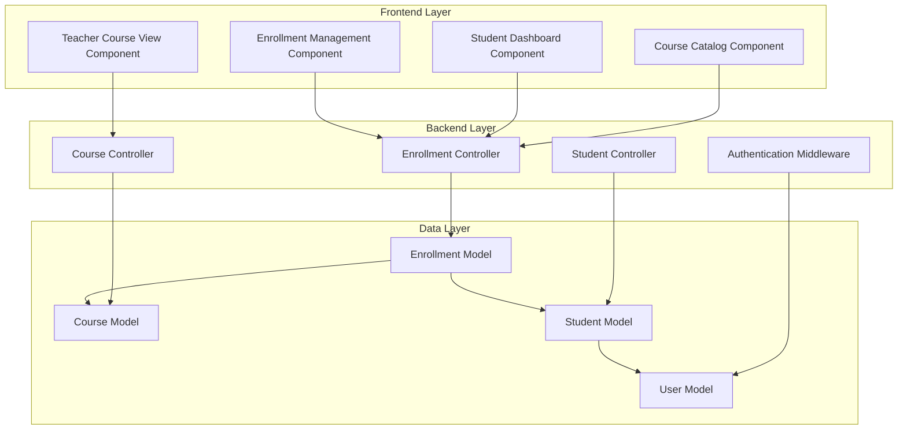

# Design Document: Student Enrollment System

## Overview

The Student Enrollment System provides a comprehensive solution for managing course enrollments in an academic environment. It integrates with the existing user authentication and course management systems to enable students to browse courses, enroll in classes, and manage their academic schedules while maintaining data integrity and handling concurrent operations safely.

The system follows a three-tier architecture with a React frontend, Node.js/Express backend, and MongoDB database. It implements role-based access control to ensure appropriate permissions for students, teachers, and administrators.

## Architecture

### System Components



### Data Flow

1. **Course Discovery**: Students browse available courses through the Course Catalog
2. **Enrollment Process**: Students initiate enrollment, system validates capacity and prerequisites
3. **Enrollment Confirmation**: System updates course enrollment count and student schedule
4. **Schedule Management**: Students view and manage their enrolled courses
5. **Administrative Oversight**: Teachers and admins monitor and manage enrollments

## Components and Interfaces

### Frontend Components

#### CourseCatalog Component
- **Purpose**: Display available courses with enrollment information
- **Props**: `userRole: string, filters: CourseFilters`
- **State**: `courses: Course[], loading: boolean, filters: CourseFilters`
- **Key Methods**: `fetchCourses()`, `handleEnroll()`, `applyFilters()`

#### StudentDashboard Component
- **Purpose**: Show student's enrolled courses and academic summary
- **Props**: `studentId: string`
- **State**: `enrolledCourses: Course[], totalCredits: number, loading: boolean`
- **Key Methods**: `fetchEnrolledCourses()`, `handleDrop()`, `calculateCredits()`

#### EnrollmentManagement Component
- **Purpose**: Handle enrollment and drop operations
- **Props**: `courseId: string, studentId: string, action: 'enroll' | 'drop'`
- **State**: `processing: boolean, error: string | null`
- **Key Methods**: `processEnrollment()`, `confirmAction()`

### Backend Controllers

#### EnrollmentController
- **Purpose**: Manage all enrollment-related operations
- **Key Methods**:
  - `enrollStudent(courseId, studentId)`: Handle student enrollment with concurrency control
  - `dropStudent(courseId, studentId)`: Remove student from course
  - `getStudentEnrollments(studentId)`: Retrieve student's enrolled courses
  - `getCourseEnrollments(courseId)`: Get all students enrolled in a course

#### StudentController (Enhanced)
- **Purpose**: Manage student profiles and academic records
- **Key Methods**:
  - `createStudentProfile(userId, studentData)`: Link user account to student profile
  - `getStudentProfile(userId)`: Retrieve student information
  - `updateStudentProfile(studentId, updates)`: Update student information

### API Endpoints

```typescript
// Enrollment endpoints
POST   /api/enrollments                    // Enroll student in course
DELETE /api/enrollments/:courseId/:studentId // Drop student from course
GET    /api/enrollments/student/:studentId  // Get student's enrollments
GET    /api/enrollments/course/:courseId    // Get course enrollments

// Enhanced student endpoints
POST   /api/students/profile               // Create student profile
GET    /api/students/profile/:userId       // Get student profile
PUT    /api/students/profile/:studentId    // Update student profile
GET    /api/students/:studentId/schedule   // Get student's course schedule
```

## Data Models

### Enhanced Student Model

```typescript
interface IStudent extends Document {
  user: ObjectId;           // Reference to User document
  studentId: string;        // Unique student identifier
  firstName: string;        // From linked User account
  lastName: string;         // From linked User account
  email: string;           // From linked User account
  major: string;           // Student's major field of study
  year: number;            // Academic year (1-4)
  gpa: number;             // Grade point average
  enrolledCourses: ObjectId[]; // References to enrolled courses
  totalCredits: number;    // Current semester credit hours
  maxCredits: number;      // Maximum allowed credits per semester
  isActive: boolean;       // Student account status
  advisorId?: ObjectId;    // Reference to advisor (teacher)
}
```

### Enrollment Model

```typescript
interface IEnrollment extends Document {
  student: ObjectId;       // Reference to Student
  course: ObjectId;        // Reference to Course
  enrollmentDate: Date;    // When student enrolled
  status: 'enrolled' | 'dropped' | 'completed'; // Enrollment status
  grade?: string;          // Final grade (if completed)
  credits: number;         // Credit hours for this enrollment
  semester: string;        // Enrollment semester
  academicYear: string;    // Academic year
}
```

### Enhanced Course Model

```typescript
interface ICourse extends Document {
  // Existing fields...
  prerequisites: ObjectId[]; // Required prerequisite courses
  corequisites: ObjectId[];  // Courses that must be taken concurrently
  enrollmentDeadline: Date;  // Last date for enrollment
  dropDeadline: Date;        // Last date to drop without penalty
  waitlistEnabled: boolean;  // Whether course supports waitlist
  waitlistCapacity: number;  // Maximum waitlist size
}
```

## Correctness Properties

*A property is a characteristic or behavior that should hold true across all valid executions of a system-essentially, a formal statement about what the system should do. Properties serve as the bridge between human-readable specifications and machine-verifiable correctness guarantees.*

<function_calls>
<invoke name="prework">
<parameter name="featureName">student-enrollment

### Property Reflection

After analyzing all acceptance criteria, I identified several areas where properties can be consolidated to eliminate redundancy:

- **Course Display Properties**: Properties 1.1 and 1.2 can be combined into a comprehensive course catalog display property
- **Enrollment Spot Management**: Properties 2.2 and 4.2 are inverses and can be combined into a single enrollment capacity invariant
- **Credit Hour Calculations**: Properties 3.4 and 4.5 can be combined into a comprehensive credit calculation property
- **Confirmation Messages**: Properties 2.5 and 4.4 follow the same pattern and can be combined
- **Student Information Display**: Properties 5.2 and 3.2 follow similar patterns for displaying complete information

### Core Correctness Properties

Property 1: Course catalog completeness and accuracy
*For any* active course in the system, the course catalog should display that course with all required information (course code, name, description, credits, instructor, available spots) and accurate enrollment status
**Validates: Requirements 1.1, 1.2, 1.3**

Property 2: Course filtering and search accuracy
*For any* filter criteria or search term, the course catalog should return only courses that match the specified criteria in the appropriate fields
**Validates: Requirements 1.4, 1.5**

Property 3: Enrollment capacity invariant
*For any* course, the sum of enrolled students should never exceed the maximum capacity, and available spots should always equal maximum capacity minus enrolled count
**Validates: Requirements 2.2, 2.3, 4.2**

Property 4: Enrollment operation success
*For any* valid student and available course, enrollment should succeed, add the student to the course, and prevent duplicate enrollments
**Validates: Requirements 2.1, 2.4**

Property 5: Student dashboard accuracy
*For any* student, their dashboard should display exactly the courses they are enrolled in with complete course information and accurate total credit hours
**Validates: Requirements 3.1, 3.2, 3.4**

Property 6: Course drop operation correctness
*For any* enrolled student-course pair, dropping the course should remove the student from enrollment, increase available spots, and update credit calculations
**Validates: Requirements 4.1, 4.2, 4.5**

Property 7: Teacher enrollment visibility
*For any* teacher and their assigned courses, the teacher should see all enrolled students with complete student information and accurate enrollment statistics
**Validates: Requirements 5.1, 5.2, 5.4**

Property 8: Admin enrollment override capabilities
*For any* admin user, they should be able to enroll students in full courses, remove students from any course, and have all actions properly logged
**Validates: Requirements 6.1, 6.2, 6.3, 6.4**

Property 9: Enrollment statistics accuracy
*For any* course, the displayed enrollment numbers, capacity information, and availability indicators should accurately reflect the current enrollment state
**Validates: Requirements 7.1, 7.2**

Property 10: Concurrent enrollment safety
*For any* set of concurrent enrollment attempts on the same course, the system should prevent over-enrollment and maintain capacity limits regardless of timing
**Validates: Requirements 8.1**

Property 11: Data integrity maintenance
*For any* enrollment operation (enroll, drop, delete course, deactivate student), the system should maintain referential integrity and rollback failed operations completely
**Validates: Requirements 8.2, 8.3, 8.4, 8.5**

## Error Handling

### Enrollment Errors

1. **Capacity Exceeded**: When a course reaches maximum capacity, return HTTP 409 with clear message
2. **Duplicate Enrollment**: When student attempts to enroll in same course twice, return HTTP 400
3. **Prerequisites Not Met**: When student lacks required prerequisites, return HTTP 422 with missing prerequisites
4. **Credit Limit Exceeded**: When enrollment would exceed student's credit limit, return HTTP 422
5. **Enrollment Deadline Passed**: When attempting to enroll after deadline, return HTTP 410

### Concurrency Error Handling

1. **Race Condition Detection**: Use database transactions with optimistic locking
2. **Retry Logic**: Implement exponential backoff for concurrent enrollment attempts
3. **Deadlock Prevention**: Order database operations consistently to prevent deadlocks
4. **Transaction Rollback**: Ensure failed operations don't leave partial state changes

### Data Validation Errors

1. **Invalid Student ID**: Verify student exists and is active before enrollment operations
2. **Invalid Course ID**: Verify course exists and is active before enrollment operations
3. **Role Permission Errors**: Verify user has appropriate role for requested operations
4. **Data Consistency Errors**: Validate enrollment data integrity before committing changes

## Testing Strategy

### Dual Testing Approach

The system will use both unit testing and property-based testing to ensure comprehensive coverage:

**Unit Tests** will focus on:
- Specific enrollment scenarios and edge cases
- Error condition handling and validation
- Integration between components
- User interface interactions and confirmations

**Property-Based Tests** will focus on:
- Universal properties that hold across all inputs
- Comprehensive input coverage through randomization
- Concurrency and race condition testing
- Data integrity and consistency validation

### Property-Based Testing Configuration

- **Testing Framework**: fast-check for TypeScript/JavaScript property-based testing
- **Test Iterations**: Minimum 100 iterations per property test
- **Concurrency Testing**: Use worker threads to simulate concurrent operations
- **Data Generation**: Smart generators that create realistic student, course, and enrollment data

Each property test will be tagged with:
**Feature: student-enrollment, Property {number}: {property_text}**

### Testing Implementation Requirements

1. **Concurrent Enrollment Testing**: Simulate multiple students enrolling simultaneously
2. **Capacity Boundary Testing**: Test enrollment at exact capacity limits
3. **Credit Calculation Testing**: Verify credit hour calculations across various scenarios
4. **Role-Based Access Testing**: Ensure proper permissions for different user roles
5. **Data Integrity Testing**: Verify referential integrity during all operations

### Mock Data Strategy

- Generate realistic course catalogs with varying capacities and prerequisites
- Create diverse student profiles with different academic standings
- Simulate realistic enrollment patterns and timing scenarios
- Test with edge cases like zero-capacity courses and maximum credit loads